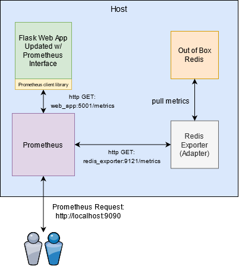
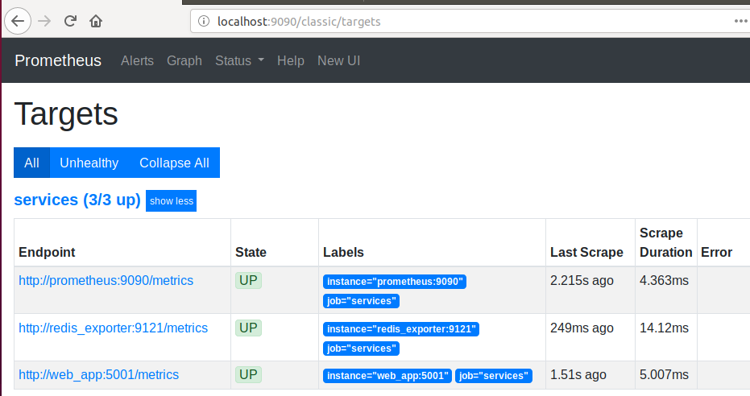

# The Adapter Design Pattern
## Commonly used to modify the interface of an existing application, so that it adheres to requirements. In this example, we will apply this design pattern to an existing redis key value store container that doesn't have a proper interface to allow the prometheus monitoring application to scrape information from it. Prometheus expects a /metrics http endpoint to be exposed for every application being monitored, and the redis application doesn't natively provide said interface. This is where the adapter pattern fits in nicely, as we don't have to alter the redis app to enable this interface. We can simply spin up the redis_exporter container, which will sit in between redis and prometheus, and will pull stats from the former and provide to the latter in the required format. To show an alternate and suboptimal approach, we will manually update an existing flask web application to expose the /metrics interface using the prometheus clienty library. Note that the second approach is less modular, isn't reusable, and is tightly coupled with the app. In addition, an issue with the prometheus client library and code could negatively impact the application container, so by using the adapter approach one can segregate these duties and prevent a failure with one impacting the other. 



## Prerequisites:  
Install the docker engine and docker compose before proceeding.  

Offical Docker install reference:  
https://docs.docker.com/engine/install  

Offical Docker compose install reference:
https://docs.docker.com/compose/install/

## Build Procedure:
1. Ensure docker is installed correctly by verifying the version:  
  ```shell
  sudo docker --version 
  ```
  
2. Ensure docker compose is installed correctly by verifying the version:  
  ```shell  
  sudo docker-compose --version   
  ```
  
3. Navigate to the monitor_interface directory, and then start up all containers via docker compose  
  ```shell  
  sudo docker-compose up -d 
  ```

4. Wait a few seconds, and then check the health of each container:  
  ```shell
  sudo docker ps
  ```

5. Open a web browser, and navigate to the following URL to access the prometheus monitoring service:  
  ```shell
  http://localhost:9090/classic/targets   
  ```
  
6. You should see three endpoints, and ensure the state of each endpoint is 'UP':   
 
  

*Note: Prometheus is actually monitoring itself as you can see prometheus:9090 as one of the endpoints. You can also see the web_app:5001 endpoint which manually implemented the prometheus client library to expose the /metrics endpoint (suboptimal). The last endpoint is the redis_exporter:9121 which acts on behalf of the redis container, and exposes its metrics to the prometheus service via the expected interface (optimal).


