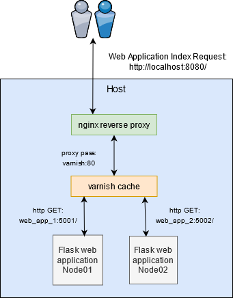
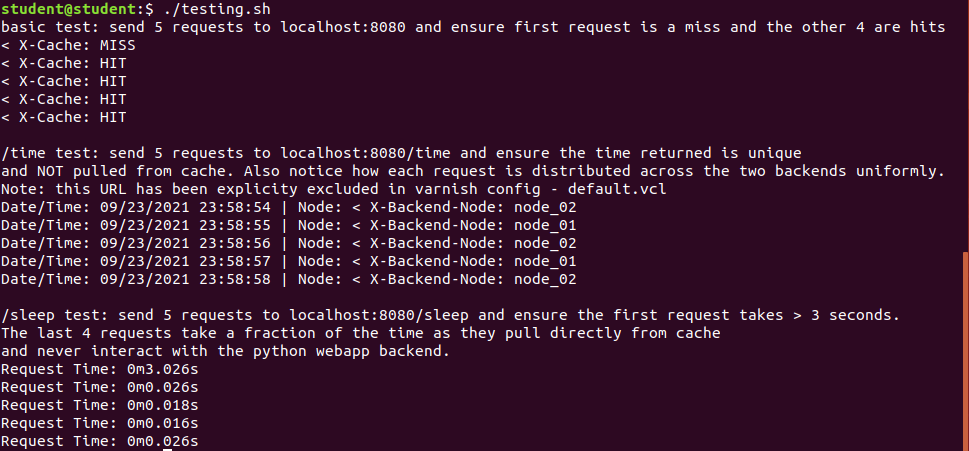

# The Replicated Load-Balanced Design Pattern
## Commonly used to create both highly available and easily scalable services. This is one of the most basic serving patterns in distributed computing, where a load-balancer/reverse proxy sits in front of the backend services faciliating user requests. This facade allows you to lose a certain percentage of your backend compute without compromising the overall availability for your service. In addition, it makes scaling quite easy as you can simply introduce a new server/container and add it to the load balancing configuration to start receiving requests. In this specific example, we implement an nginx container as our reverse proxy which will initially handle all user requests. Nginx will then pass requests to the varnish service, which is considered an http accelerator and handles caching of requests. If a specific request is not found in the varnish cache, this is considered a miss. In this case, varnish will then pass on the request to one of the configured backends, which are load balacned in a round robin fashion. The backend will fulfill the request, and send it back to the varnish cache. Varnish will then send this request back to nginx, which will send it back to the original requestor. The real value of varnish comes in play when a request comes in that already has a cached response held in varnish. This is considered a cache hit. This means that the requests stops at varnish, and is sent right back to nginx with the response. The backends were never contacted to fulfill this request, which can drastically improve response times.



## Prerequisites:  
Install the docker engine and docker compose before proceeding.  

Offical Docker install reference:  
https://docs.docker.com/engine/install  

Offical Docker compose install reference:   
https://docs.docker.com/compose/install/

## Build Procedure:
1. Ensure docker is installed correctly by verifying the version:  
  ```shell
  sudo docker --version 
  ```
  
2. Ensure docker compose is installed correctly by verifying the version:  
  ```shell  
  sudo docker-compose --version   
  ```
  
3. Navigate to the varnish_caching directory, and then start up all containers via docker compose  
  ```shell  
  sudo docker-compose up -d 
  ```

4. Wait a few seconds, and then check the health of each container:  
  ```shell
  sudo docker ps
  ```

5. In a terminal/shell, run the testing script that will send various types of http requests via curl to this replicated load-balanced service:  
  ```shell
  ./testing.sh 
  ```
  
6. You should see the output of three different tests. The first test simply shows you how caching is utilized in this service, and that only the first request actually makes it to a backend web application, while the other 4 are returned directly from varnish which decreases response time. The second test is used to demonstrate how to exclude specific URLs that cannot be cached and require unique content generated dynamically by the backend for every request. You will notice that the time being returned is unique for each request, which means caching is not utilized. You will also notice that the backends are being load balanced uniformly as expected. The third test demonstrates the utility of caching, as there is a /sleep URI that simulates a long running request (function sleeps for 3 seconds). You will notice that only the first request is actually handled by a backend, which takes longer than 3 seconds to complete the request. The next 4 requests never make it to this long running process and are pulled directly from cache, so this drastically reduces the response time.  


