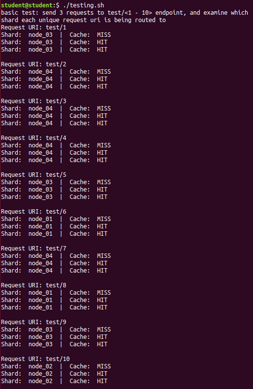
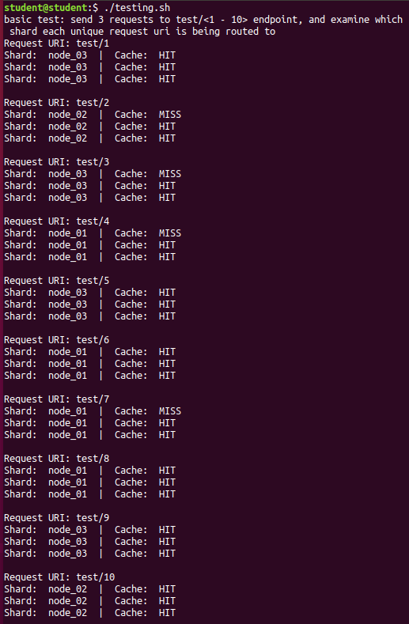

# The Sharded Design Pattern
## <Add Description Here>


## Prerequisites:  
Install the docker engine and docker compose before proceeding.  

Offical Docker install reference:  
https://docs.docker.com/engine/install  

Offical Docker compose install reference:   
https://docs.docker.com/compose/install/

## Build Procedure:
1. Ensure docker is installed correctly by verifying the version:  
  ```shell
  sudo docker --version 
  ```
  
2. Ensure docker compose is installed correctly by verifying the version:  
  ```shell  
  sudo docker-compose --version   
  ```
  
3. Navigate to the consistent_hashing_cache, and create symbolic links for both docker-compose and nginx configuration files:    
  ```shell  
  ln -s 4_shards_docker-compose.yml docker-compose.yml
  ln -s 4_shards_nginx.conf nginx.conf
  ```

*Note: We are going to be swapping out these files later, so sym links will make this easier. We will start out with configuration sized for 4 shards of varnish cache and flask web app.

4. Startup all containers via docker-compose:    
  ```shell  
  sudo docker-compose up -d
  ```

5. Ensure all containers are running and healthy:    
  ```shell  
  sudo docker ps
  ```
  
6. Test out the services via a pre-built shell script which will send 10 unique requests, 3 times each, which should yield a ~66% cache hit rate. The first of the three requests should result in a cache miss, while the subsequent two should be served directly from varnish cache.    
  ```shell  
  ./testing.sh
  ```
*Note which requests were served by which shards, as this will be useful to reference after we modify the environment and remove one of the shards.



7. Remove the current sym link for docker-compose.yml file and create a new one routing the sym link to the config w/ 3 shards (removing one shard):    
  ```shell  
  rm docker-compose.yml
  ln -s 3_shards_docker-compose.yml docker-compose.yml
  ```

8. Start docker-compose to reload update configuration without impacting the running containers. In addition, this will remove the 4th shard (varnish and web app):     
  ```shell  
  sudo docker-compose up -d --no-recreate --remove-orphans
  ```
  
9. Ensure the 4th shard containers have been removed and the existing/remaining containers were NOT restarted:     
  ```shell  
  sudo docker ps
  ```
  
10. Remove the current sym link for nginx.conf and assign to the 3 sharded nginx config:     
  ```shell  
  rm nginx.conf
  ln -s 3_shards_nginx.conf nginx.conf
  ```
  

11. Restart the nginx contianer without impacting the other containers:     
  ```shell  
  sudo docker-compose restart nginx
  ```
  
12. Ensure the nginx container was restarted and the existing containers were NOT restarted:     
  ```shell  
  sudo docker ps
  ```

13. Run the same test again, and you should notice that you your cache hit rate is > ~66% which was observed in the first pass. In my tests, I noticed an average cache hit rate of ~86% after removing a shard from the environment. This equates to 6 out of 10 cache hits for the initial requests sent in this test, which is far better than 0.      
  ```shell  
  ./testing.sh
  ```

*This is due to the consistent hashing algorithm used to assign requests to shards, which should be quite useful in situations such as theses when shards are removed or added. If consistent hashing wasn't used, then you would expect to see an identical hit rate to the first test, where every initial request resulted in a cache miss. 


